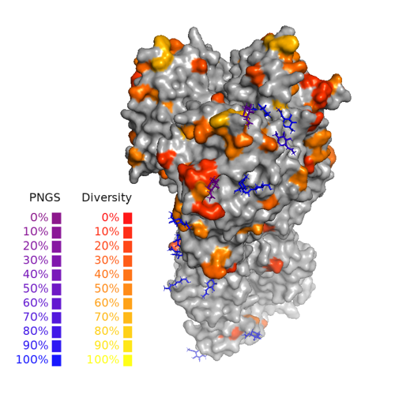

# Flu Strain Compare





## Purpose

Flu Strain Compare generates visualizations of mutations between pairs of HA sequences. `make_comparison_figure.py` takes two HA sequences as input and outputs a figure highlighting amino acid and PNGS changes on a representative HA crystal structure. At present, H1pdm and H3 strains are supported.


## Dependencies

This utility runs on Docker, Singularity, or natively with PyMOL installed as a Python module.


### Docker

You can use the following command to build the container:

```
docker build ./ -t flu_strain_compare
```

### Singularity

Build Docker container above. This may need to be done locally if your HPC system doesn't allow Docker.

```
# load module, if in HPC environment
module load singularity
singularity build ubuntu-pymol-biopython_latest.sif docker-daemon://flu_strain_compare:latest
```

### Native

Install PyMOL as a Python library.

```
# Optional, if using a virtual environment.
python -m venv venv
source venv/bin/activate

# Install python dependencies.
pip install Bio pandas
pip install scipy

# Install PyMOL as a library.
PYMOL_VERSION=2.5.0
wget --no-verbose https://github.com/schrodinger/pymol-open-source/archive/refs/tags/v${PYMOL_VERSION}.tar.gz
tar xfz v2.5.0.tar.gz
cd pymol-open-source-2.5.0

git clone --depth=1 https://github.com/rcsb/mmtf-cpp.git
cd mmtf-cpp
git pull
cd ..
cp -r mmtf-cpp/include/mmtf* include/

python3 setup.py install
```

## Configuration

The configuration file specified in the command line (see [Running](#running) below) serves as input for the `make_comparison_figure.py` script.

* `seq_file`: Name of fasta-formatted file that contains full-length amino acid HA sequences. File must be in `data` directory.
* `q1_id`: Sequence ID of the first query strain. The sequence id is the first word in the fasta header of the desired sequence.
* `q2_id`: Sequence ID of the second query strain.
* `seq_lineage`: Lineage of the query strains. `"H1"` or `"H3"`.
* `numbering_scheme`: What numbering scheme do you want to use for mutation identification? For H1 sequences, you can choose `H1pdm`, `H3`, or `H1_1933`. For H3 sequences, only `H3` numbering is available.
* ``: What numbering scheme do you want to use for mutation identification? For H1 sequences, you can choose `H1pdm`, `H3`, or `H1_1933`. For H3 sequences, only `H3` numbering is available.
* `reference_mode`: Use the reference strain for comparison (`true` or `false`). _Note: .png output is much more resource intensive than .pse._,
* `export_files`: Export .pse file, .png file, or both. Example: `["PSE"]`,
* `filter_sites`: Filter out mutations and PNGS at the listed sites. Example: `[92, 94, 104]`,
* `reverse_filter_sites`: Only include the listed sites, and exclude others. _Note: reverse filter will override filter if both are non-empty._ Example: `[92]`
* `output_csv`: Write CSV to standard output. Default: `false` (JSON).
* `diversity_index`: `"shannon"`, `"gini-simpson"`, `"richness"` (Default: Shannon).
* `non-conservative_only`: Only include [non-conservative]() mutations to measure diversity. `true` or `false`.

Notes
* Site numbers input in "filter_sites" and "reverse_filter_sites" refer to amino acid numbering in the final HA proteins, after signaling peptides have been removed, from the start of HA1. The output table includes both numbering schemes (with and without signaling peptides), for reference 


## Running


_Note: `flu_strain_compare_path` is an absolute path to the root of this repository._

```
export flu_strain_compare_path=/some/abs/path/flu_strain_compare
```

### Docker

With your configuration file set up to your liking, run the container with the following commands:


```
docker run -v ${flu_strain_compare_path}:/app flu_strain_compare python3 src/<SCRIPT NAME>.py configuration/config.json
```

### Singularity

```
singularity exec --bind ${flu_strain_compare_path}:/app ubuntu-pymol-biopython_latest.sif python3 src/<SCRIPT NAME>.py configuration/config.json
```

### Native

```
python src/<SCRIPT NAME>.py configuration/config.json
```

`<SCRIPT NAME>` should be `make_comparison_figure` 


Example:

```
# from repo root
singularity exec --bind /home/youruser/flu_strain_compare:/app ubuntu_pymol_biopython.sif python3 src/make_comparison_figure.py configuration/config.json
```

## Outputs

Outputs will be written to the `figures` directory of the repository.

If you wish the csv with additional information to be printed out, include 


## Unit tests

```

pytest

```

## Strains available
### H3
* 2021-2022 southern hemisphere cell-based recommendation (name = `A/Darwin/6/2021`, id = `EPI1885402`)
* 2021-2022 northern hemisphere Flublok (name = `A/Tasmania/503/2020`, id = `EPI1752480`)
* 2021-2022 northern hemisphere cell-based recommendation (name = `A/Cambodia/e0826360/2020`, id =  `EPI1843589`)
* 2020-2021 northern hemisphere Flublok (name = `A/Minnesota/41/2019`, id = `EPI1548699`)
* 2020-2021 northern hemisphere cell-based recommendation (name = `A/Hong Kong/45/2019`, id = `EPI1409001`) 
* 2019-2020 cell-based recommendation (name = `A/Kansas/14/2017`, id = `EPI1174043`)
* 2018-2019 cell-based recommendation (name = `A/Singapore/INFIMH-16-0019/2016`, id = `EPI1106235`)
* 2016-2018 cell-based recommendation (name = `A/Hong Kong/4801/2014`, id = `EPI539576`)
* 2015-2016 cell-based recommendation (name = `A/Switzerland/9715293/2013`, id = `EPI530687`)
* 2013-2015 cell-based recommendation (name = `A/Victoria/361/2011 `, id = `EPI349103`)
### H1
* 2021-2022 northern hemisphere cell-based recommendation (name = `A/Wisconsin/588/2019`, id = `EPI1715168`)
* 2020-2021 northern hemisphere cell-based recommendation (name = `A/Hawaii/70/2019`, id = `EPI1669665`) 
* 2019-2020 cell-based recommendation (name = `A/Brisbane/02/2018`, id = `EPI1212884`)
* 2017-2019 cell-based recommendation (name = `A/Michigan/45/2015`, id = `EPI699812`
* 2009-2017 cell-based recommendation (name = `A/California/04/2009`, id = `EPI178457`)
* 2013-2014 example from Linderman et al. (name = `A/Colorado/3514/2013`, id = `EPI501723`)
